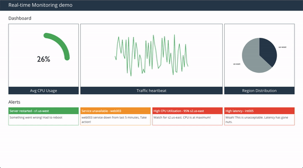
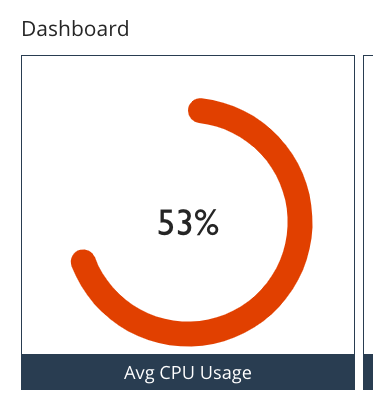

# A lightweight real-time dashboard using React, GraphQL subscriptions and Redis PubSub

Walkthrough: [https://dev.to/nowke/building-real-time-dashboard-using-react-graphql-subscriptions-and-redis-pubsub-2gip](https://dev.to/nowke/building-real-time-dashboard-using-react-graphql-subscriptions-and-redis-pubsub-2gip)

## Preview



## Setup

**Prerequisites**

* Install [NodeJS](https://nodejs.org/) (LTS)
* Install [Redis](https://redis.io/) (Server and Client)
  - MacOS - `brew install redis`
* Install [Yarn](https://yarnpkg.com/)
  - MacOS - `brew install yarn`

**Clone the repository**

```
git clone https://github.com/nowke/realtime-dashboard-demo.git
```

### (a) Setup server

**Start Redis server**

```
redis-server
```

**Install dependencies**

```
cd server
yarn install
```

**Start the server**

```
yarn start
```

Server will be running at [http://localhost:4000/](http://localhost:4000/). The below UI will be rendered


### (b) Setup worker

**Install dependencies**

```
cd worker
yarn install
```

**Start the worker**

```
yarn start
```

The following logs will be printed,

```
Starting worker
Scheduled Jobs for CPU, Traffic, distribution, messages
Fetched new results for MESSAGES
Fetched new results for CPU
Fetched new results for DISTRIBUTION
Fetched new results for CPU
Fetched new results for MESSAGES
Fetched new results for TRAFFIC
...
```

### (c) Setup client

**Install dependencies**

```
cd client
yarn install
```

**Start client**

```
yarn start
```

Client will be running at [http://localhost:3000](http://localhost:3000). Dashboard picks up initial data from Redis, update itself at intervals.


### (d) Subscribe to Redis channels

Alternatively, subscribe to Redis channel directly using `SUBSCRIBE <channel>` command to get the feel of it!

For example, subscribe to CPU utilization channel - `cpu`. Observe values getting published to the channel while the worker is running.

```
$ redis-cli
127.0.0.1:6379> SUBSCRIBE cpu
Reading messages... (press Ctrl-C to quit)
1) "subscribe"
2) "cpu"
3) (integer) 1
4) "message"
5) "cpu"
6) "{\"cpu\":{\"percentage\":51}}"
7) "message"
8) "cpu"
9) "{\"cpu\":{\"percentage\":74}}"
10) "message"
11) "cpu"
12) "{\"cpu\":{\"percentage\":51}}"
13) "message"
14) "cpu"
15) "{\"cpu\":{\"percentage\":43}}"
...
```

### (e) Publish to Redis channels

Kill the worker process to stop the dashboard from getting new values. Now, publish the values directly from Redis using `PUBLISH <channel> <value>` command.

> Note: Provide a valid JSON String as `value` for the dashboard to render the value correctly.

Publish a `53%` value as CPU percentage

```
$ redis-cli
127.0.0.1:6379> PUBLISH cpu "{\"cpu\":{\"percentage\":53}}"
(integer) 1
127.0.0.1:6379>
```

And, the dashboard's CPU panel shows `53%` value immediately



Available channels in the example are,

* `cpu`
* `traffic`
* `distribution`
* `messages`

## References

* [GraphQL Subscriptions](https://www.apollographql.com/docs/react/advanced/subscriptions.html)
* [Redis PubSub](https://redis.io/topics/pubsub)
