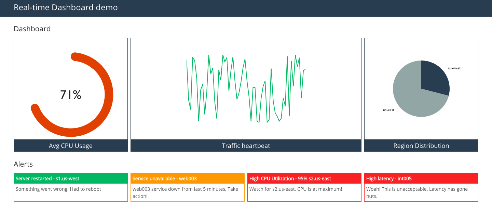

# Real-time Dashboard (Client)

**Install dependencies**

```
cd client
yarn
```

**Start client**

```
yarn start
```

Client will be running at [http://localhost:3000](http://localhost:3000). Dashboard picks up initial data from Redis, update itself at intervals.

