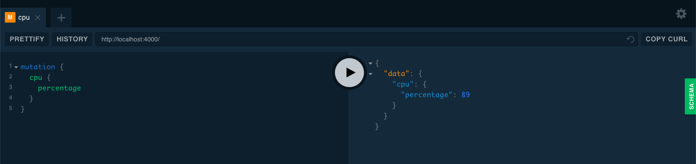

# Real-time Dashboard (Server)

**Install dependencies**

```
cd server
yarn install
```

**Start the server**

```
yarn start
```

Server will be running at [http://localhost:4000/](http://localhost:4000/). The below UI will be rendered

